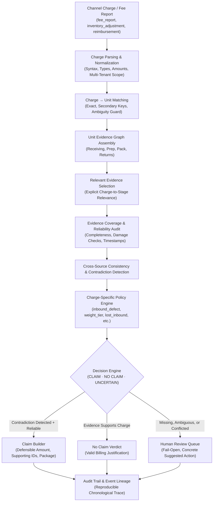
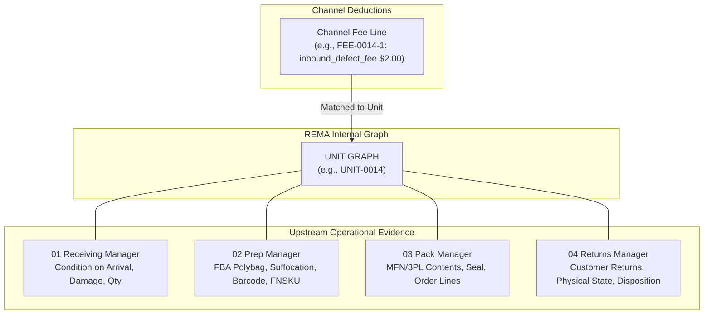

# REMA — Recovery Manager: Architecture Specification
**Step 5 of 5 · Money Back**  
*Turn operational evidence into defensible recovery claims.*

---

## 1. Executive System Overview

REMA (Recovery Manager) is an evidence-driven financial recovery engine that ingests channel fee and reimbursement reports, matches charges to physical inventory units, reconstructs an upstream operational evidence graph (spanning Receiving, Prep, Pack, and Returns), rigorously audits evidence reliability, detects contradictions between operational proof and channel deductions, and produces defensible dollar-value recovery claims.

Unlike generic spreadsheet joiners or unconstrained LLM prompts, REMA enforces a **deterministic-first architecture**. Financial claims must be supported by verifiable operational evidence, real dollar values taken directly from channel records, categorical reliability assessments, and complete audit trail lineage.



---

## 2. Evidence Graph Architecture

Operational commerce data is fundamentally hierarchical and multi-modal. A single inventory unit (`unit_id`) traverses distinct operational stages, each managed by independent upstream systems:



### Upstream Interoperability & Routing
- **FBA vs. MFN Routing Invariant**: Units are routed either through FBA (Receiving $\rightarrow$ Prep $\rightarrow$ Channel) or Merchant Fulfilled / 3PL (Receiving $\rightarrow$ Pack $\rightarrow$ Buyer). They never traverse both Prep and Pack. REMA actively validates this mutual exclusivity; any unit containing both stages is flagged as `CONFLICTED`.
- **Preservation of Raw Audits**: Original row payloads and image references (`photo_refs`) are stored unaltered in SQLite `raw_record` JSON fields alongside normalized representations.

---

## 3. Row-Level Security & Multi-Tenancy

In accordance with Engineering Rule 1, REMA implements strict organization-scoped isolation:
- Every table (`charges`, `units`, `upstream_evidence`, `decisions`, `claims`, `reviews`, `audit_log`, `processing_runs`) possesses a mandatory `org_id` column as part of its primary or foreign key structure.
- Access to data is mediated exclusively through `TenantRepository` instances tied to a specific `org_id`.
- Queries omitting tenant qualification or attempting cross-tenant record retrieval are strictly disallowed.
- Demonstrated with isolated test tenants: `org_demo_alpha` and `org_demo_bravo`.

---

## 4. Deterministic Decision Engine & Charge Policies

REMA uses a modular, extensible policy layer (`src/core/policies/`). Each charge type executes a specialized evaluation strategy:

### 1. `inbound_defect_fee` Policy
- **Objective**: Determine whether reported inbound prep defects (e.g., missing polybag, obscured suffocation warning, crooked barcode, uncovered manufacturer barcode) are refuted by prep station photographic audits.
- **Support Condition**: Prep audit records show non-compliance (e.g., `original_barcode_covered == 'no'`, `polybag_present_sealed == 'not_sealed'`) $\rightarrow$ **`NO_CLAIM`**.
- **Contradiction Condition**: Prep audit verifies all 6 compliance checks as `PASS` and Receiving logs show no pre-existing defects $\rightarrow$ **`CLAIM`** ($amount_usd from charge record).
- **Uncertainty Condition**: Required prep evidence is missing, any check is `UNCERTAIN`, or Receiving flagged prior damage (`obvious_defect`, `water`) $\rightarrow$ **`UNCERTAIN / REVIEW`**.

### 2. `fulfilment_fee_weight_tier` Policy
- **Objective**: Recover overcharges resulting from channel cubiscan or dimensional weight mis-tiering.
- **Rule**: Baseline tier is established from the minimum fee charged for that exact SKU under standard packaging.
- **Contradiction Condition**: Charge exceeds baseline tier, Prep logs confirm standard packaging with no dimensional expansion, and Receiving confirms no package crushing/water damage $\rightarrow$ **`CLAIM`** (excess tier amount).
- **Support Condition**: Charge equals established SKU baseline $\rightarrow$ **`NO_CLAIM`**.
- **Uncertainty Condition**: Receiving noted package damage/distortion that may explain weight tier shift $\rightarrow$ **`UNCERTAIN / REVIEW`**.

### 3. `lost_inbound` Policy
- **Objective**: Reconcile inventory adjustment lines against warehouse dock check-ins.
- **Condition**: If dock received full count (`qty_received == qty_ordered`) and prep handled the unit, channel loss in network is confirmed. Because channel adjustment lines report $0.00 valuation, REMA enforces Rule 4: flags as **`UNCERTAIN`** with `ZERO_VALUATION` issue type, providing an actionable recommendation: "Apply SKU wholesale valuation schedule to file claim."
- If dock received short $\rightarrow$ **`NO_CLAIM`** (supplier shortage, not channel loss).

### 4. `refund_issued_item_not_returned` Policy
- **Objective**: Contest charges where channel claimed customer failed to return merchandise.
- **Contradiction**: Returns station audit proves physical receipt of return with verified disposition (e.g. `restock`, `liquidate`) $\rightarrow$ channel claim is contradicted. Flagged as **`UNCERTAIN`** with `ZERO_VALUATION` if charge is $0.00 to prompt valuation schedule attachment.

### 5. `damaged_in_warehouse` Policy
- **Reconciliation**: When channel reimbursement report credits reimbursement ($14.00) and Receiving confirms undamaged arrival, REMA records **`NO_CLAIM`** (already compensated).

---

## 5. Fail-Open Architecture & Human Review Queue

In compliance with Engineering Rule 3 and Rule 4:
- System runtime errors, missing evidence, cross-source discrepancies, and ambiguous unit mappings never result in a silent `NO CLAIM` or dropped record.
- Affected charges are preserved in full and routed to the **Human Review Queue** (`reviews` table).
- Each review item includes:
  - `issue_type` (`MISSING_EVIDENCE`, `CONFLICTING_EVIDENCE`, `AMBIGUOUS_UNIT_MATCH`, `ZERO_VALUATION`, `DEGRADED_EVIDENCE`, `MALFORMED_CHARGE`)
  - `severity` (`CRITICAL`, `HIGH`, `MEDIUM`, `LOW`)
  - `suggested_action` (e.g., "Inspect prep photo audit to confirm packaging type", "Apply SKU wholesale valuation schedule")
  - Status tracking (`PENDING`, `RESOLVED`, `DISMISSED`) with operator resolution notes and audit logging.

---

## 6. Audit Trail Lineage

Every decision produces an unalterable chronological audit stream:
```text
CHARGE_INGESTED 
   ──▶ CHARGE_NORMALIZED 
   ──▶ UNIT_MATCHED 
   ──▶ EVIDENCE_RETRIEVED 
   ──▶ DECISION_PRODUCED 
   ──▶ CLAIM_CREATED / REVIEW_ENQUEUED
```
This enables auditors and channel compliance officers to trace any claim directly back to the physical warehouse station, operator ID, timestamp, and photo reference.

---

## 7. Frontend Styling Architecture & Design System

The user interface is built as a focused, high-clarity financial operations and recovery console. It rejects decorative AI dashboard tropes (excessive animations, saturated gradients, glassmorphism) in favor of a serious, defensible financial SaaS aesthetic.

### Modular CSS Directory Structure
```text
client/
├── index.html
├── app.js                    (Controller logic only; zero styling or inline style strings)
└── css/
    ├── index.css             (Master entry point importing modular components)
    ├── variables.css         (REMA design tokens & CSS custom properties)
    ├── global.css            (Base reset, header, navigation, typography, layout)
    ├── responsive.css        (Desktop, tablet <960px, and mobile <640px breakpoints)
    └── components/
        ├── metrics.css       (KPI cards, operational scenario demo bar)
        ├── tables.css        (Data tables, categorical badges, action buttons)
        ├── claim-detail.css  (6-step evidence lineage stepper, assessment cards, JSON modal)
        └── review-queue.css  (Human review item cards, interactive resolution modal)
```

### REMA Visual Style & Tokens
- **White Background**: `--rema-background: #FFFFFF`
- **Army Green / Olive Primary**: `--rema-primary: #3F5138`, `--rema-primary-dark: #26351F`, `--rema-primary-light: #52674A`
- **Dark Green Text**: `--rema-primary-dark: #26351F` and `--rema-text: #1E241B`
- **Soft Light-Green Surfaces**: `--rema-surface: #F9FAF8`, `--rema-surface-subtle: #EEF2EA`
- **Minimal Borders**: `--rema-border: #E3E7DF`, `--rema-border-subtle: #ECEFEA`
- **Subtle Shadows**: `0 1px 3px rgba(38, 53, 31, 0.04)`
- **Clean Typography**: System sans-serif stack (`-apple-system, BlinkMacSystemFont, "Segoe UI", Roboto`) with monospace support for financial identifiers and evidence tokens.


