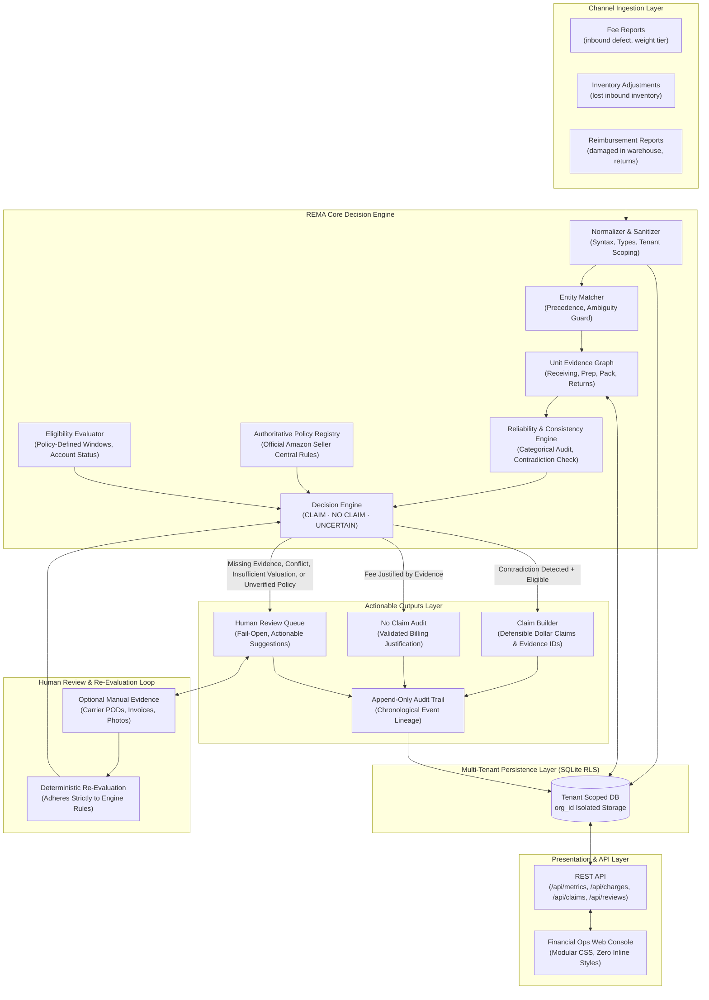
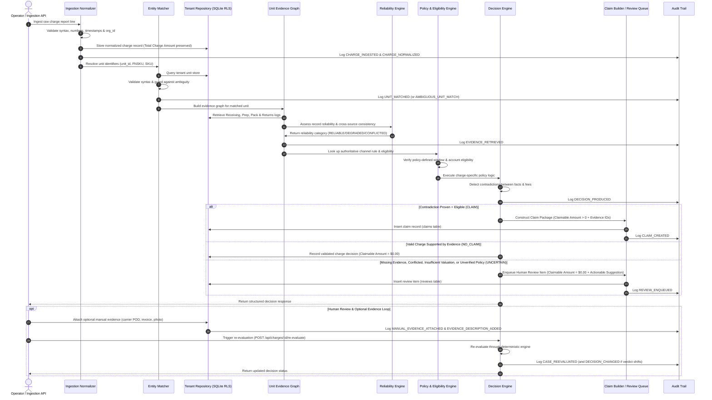

# REMA — Recovery Manager: Architecture Specification
**Step 5 of 5 · Money Back**  
*Turn operational evidence into defensible recovery claims.*

---

## Table of Contents
1. [System Architecture](#1-system-architecture)
2. [Components](#2-components)
3. [Data Flow](#3-data-flow)
4. [Model / Agent Usage](#4-model--agent-usage)
5. [Important Engineering Decisions](#5-important-engineering-decisions)

---

## 1. System Architecture

REMA (Recovery Manager) is architected as an evidence-driven, deterministic financial arbitration engine that reconciles e-commerce channel fee and adjustment reports against upstream physical warehouse operational records.

Unlike conventional spreadsheet joiners or unconstrained LLM prompt wrappers, REMA enforces a **deterministic-first, multi-layered architecture**. Core normalization, identifier resolution, evidence correlation, reliability auditing, eligibility lookbacks, and dispute policies are executed by deterministic code designed to prioritize high claim precision, conservative uncertainty handling, and complete audit lineage.

REMA compiles **defensible recovery claim packages** with supporting operational evidence references for seller review and dispute filing. It deliberately avoids direct, automated submission to Amazon Seller Central or external channel dispute APIs, ensuring human review and operational governance over all external dispute filings.

### High-Level System Topology



### Layered Architecture Breakdown

1. **Ingestion & Normalization Layer**:
   - Ingests tabular CSV reports or JSON streams from channel fee schedules, inventory adjustments, and reimbursement reports.
   - Cleanses whitespace, normalizes currency amounts, validates date formats, and enforces organization scoping (`org_id`).
   - Distinguishes between the reported **Total Charge Amount** (the amount billed or adjusted by the channel) and tags malformed records (`is_malformed: true`) without dropping them.
2. **Multi-Tenant Persistence Layer**:
   - Backed by Node.js native SQLite with zero external database dependencies.
   - Implements **Row-Level Security (RLS)** by mandating an `org_id` column across all relational tables (`charges`, `units`, `upstream_evidence`, `decisions`, `claims`, `reviews`, `audit_log`, `manual_evidence`).
   - Mediated exclusively through tenant-scoped repository instances (`TenantRepository`).
3. **Unit Evidence Graph Layer**:
   - Reconstructs the end-to-end physical lifecycle of each inventory unit by traversing records from the four upstream operational managers:
     - **Stage 01: Receiving** (carton condition, unit damage, bill of lading arrival stamps).
     - **Stage 02: Prep** (polybag thickness, seal status, suffocation warning legibility, FNSKU placement, barcode coverage, photo audits).
     - **Stage 03: Pack** (order line verification, box packing, merchant-fulfilled validation).
     - **Stage 04: Returns** (physical reverse-logistics receipt, observed condition, restock/liquidation disposition).
   - Validates supply chain invariants (e.g., FBA vs. MFN mutual exclusivity).
4. **Authoritative Policy & Grounding Layer**:
   - Connects each charge category to official published channel rules (e.g., Amazon Seller Central Inbound Defect Problem Investigation Policy `GL5XA3MNXAJKJE8E`).
   - Enforces filing windows and eligibility conditions only when supported by a verified policy source. Unverified or unavailable policy conditions fail open to `UNCERTAIN`.
   - Fails open to `UNCERTAIN` if an authoritative policy source is unavailable or unverified.
5. **Deterministic Decision Engine**:
   - Evaluates operational evidence against authoritative rules and charged fees.
   - Distinguishes clearly between the **Total Charge Amount** (channel-reported deduction) and the **Claimable Amount** (recoverable dollar amount determined by operational refutation).
   - Categorizes evidence reliability into `RELIABLE`, `DEGRADED`, `CONFLICTED`, or `INSUFFICIENT`.
   - Identifies contradictions between operational facts and channel charges (e.g., Prep verified polybag sealed, but channel charged for unsealed polybag).
   - Produces three discrete outcomes: `CLAIM`, `NO_CLAIM`, or `UNCERTAIN`.
6. **Claim Builder & Human Review Layer**:
   - `CLAIM` outcomes compile into defensible claim packages containing the verified Claimable Amount, supporting operational record IDs, operator IDs, and attached photographic proof.
   - `UNCERTAIN` outcomes route directly to the **Human Review Queue** with concrete issue types and suggested actions.
7. **Append-Only Audit Trail Layer**:
   - Records every lifecycle event (`CHARGE_INGESTED`, `CHARGE_NORMALIZED`, `UNIT_MATCHED`, `EVIDENCE_RETRIEVED`, `DECISION_PRODUCED`, `CLAIM_CREATED`, `REVIEW_ENQUEUED`, `MANUAL_EVIDENCE_ATTACHED`, `EVIDENCE_DESCRIPTION_ADDED`, `CASE_REEVALUATED`, `DECISION_CHANGED`).
   - Delivers complete operational traceability and audit readiness for seller finance and compliance teams.
8. **Presentation & API Layer**:
   - Express REST API with organization middleware (`x-tenant-id`).
   - High-clarity financial operations console built using modular CSS (`client/css/`), design tokens (`--rema-*`), and zero inline styles.

---

## 2. Components

The following table and subsections document the core components, their file locations, responsibilities, inputs, and failure behaviors.

```
src/
├── api/
│   ├── routes.js               # REST API routes, tenant middleware, endpoints
│   └── server.js               # Express HTTP server setup & static asset hosting
├── core/
│   ├── auditTrail.js           # Audit event logger & lifecycle tracer
│   ├── batchProcessor.js       # Orchestrator for bulk tenant charge processing
│   ├── claimBuilder.js         # Defensible claim compiler & evidence packager
│   ├── database.js             # SQLite schema, migrations & TenantRepository (RLS)
│   ├── decisionEngine.js       # Master deterministic decision evaluator
│   ├── eligibilityEvaluator.js # Authoritative dispute window & condition engine
│   ├── evaluation.js           # Benchmark evaluator & 22 synthetic edge cases
│   ├── evidenceGraph.js        # Unit Evidence Graph assembler & stage selector
│   ├── matcher.js              # Deterministic entity matcher with ambiguity guard
│   ├── normalizer.js           # Charge & evidence sanitizer & type validator
│   ├── reliability.js          # Categorical reliability & cross-source consistency
│   ├── reviewQueue.js          # Human Review Queue manager & issue classifier
│   ├── types.js                # System enums, categorical states & constants
│   └── policies/
│       ├── damagedWarehouse.js # Policy: Damaged in warehouse reconciliation
│       ├── inboundDefect.js    # Policy: Inbound packaging defect refutation
│       ├── index.js            # Policy bundle exports
│       ├── lostInbound.js      # Policy: Lost inbound inventory reconciliation
│       ├── policyRegistry.js   # Authoritative rule registry & Seller Central mapping
│       ├── refundUnreturned.js # Policy: Refund issued item not returned
│       └── weightTier.js       # Policy: Dimensional weight tier overcharges
└── test/
    ├── eval.test.js            # Production evaluation & synthetic benchmark suite
    ├── pipeline.test.js        # End-to-end pipeline & tenancy isolation suite
    └── recoveryOperations.test.js # Manual evidence attachment & re-evaluation suite
```

### Detailed Component Specifications

#### 1. Ingestion Normalizer (`src/core/normalizer.js`)
- **Role**: Validates, sanitizes, and maps incoming charge lines and upstream operational records into strongly-typed structures.
- **Inputs**: Raw CSV rows or JSON objects from fee schedules, inventory adjustments, and warehouse logs.
- **Outputs**: Normalized charge and evidence objects with standardized property keys, parsed numerical amounts, and ISO-8601 timestamps. Preserves the reported `amount_usd` as the Total Charge Amount.
- **Failure Mode**: When numerical amounts are corrupted or required identifiers are missing, the normalizer marks `is_malformed: true` and logs the specific syntax errors, allowing the engine to fail open rather than crashing.

#### 2. Entity Matcher (`src/core/matcher.js`)
- **Role**: Reconciles a normalized charge to a physical inventory unit within the tenant's data store.
- **Matching Precedence**:
  1. *Syntax Validation*: Verifies `unit_id` conforms to `/^UNIT-\d{4}$/`. Malformed IDs yield `MatchStatus.INVALID`.
  2. *Direct Exact Match*: Queries tenant inventory for exact `unit_id`. Checks cross-identifier consistency (`SKU`, `FNSKU`).
  3. *Secondary Key Fallback*: If `unit_id` is missing, searches by unique `FNSKU` or `SKU`.
- **Ambiguity Guard**: If multiple candidate units share an `FNSKU` or `SKU`, the matcher **declines to guess**, flagging `MatchStatus.AMBIGUOUS` with `MULTIPLE_CANDIDATES`.
- **Outputs**: `{ matched_unit_id, match_status, match_method, candidates, ambiguity_flags }`.

#### 3. Evidence Graph Manager (`src/core/evidenceGraph.js`)
- **Role**: Reconstructs the multi-stage operational history of a unit by querying upstream evidence tables.
- **Stage Traversal**: Aggregates records across Receiving, Prep, Pack, and Returns.
- **Stage Relevance Selector**: For any given charge type, extracts only the causally relevant upstream stages (e.g., `inbound_defect_fee` requires Prep and Receiving; `refund_issued_item_not_returned` requires Returns).
- **Outputs**: `EvidenceGraph` instance containing stage records, raw source payloads, and photographic audit references.

#### 4. Reliability & Consistency Engine (`src/core/reliability.js`)
- **Role**: Evaluates individual record reliability and verifies cross-source harmony across operational stages.
- **Record Reliability Categorization**:
  - `RELIABLE`: All mandatory fields, valid timestamps, operator IDs, and photo references present.
  - `DEGRADED`: Missing non-critical metadata (e.g., work order ID) or physical match flagged as uncertain.
  - `INSUFFICIENT`: Missing primary identifier or record ID.
- **Cross-Source Consistency Audits**:
  - *FBA vs. MFN Routing*: Units with both Prep (FBA) and Pack (MFN) records violate supply chain topology and are marked `MUTUAL_EXCLUSIVITY_VIOLATION`.
  - *Cross-Stage SKU Inconsistency*: Conflicting SKUs across Receiving, Prep, and Returns flag `CROSS_STAGE_SKU_MISMATCH`.
  - *Chronological Inversion*: Receiving timestamps that post-date Prep or Returns timestamps flag `CHRONOLOGICAL_INVERSION`.
  - *Damage Contradiction*: Receiving dock noting carton crushing or water damage while Prep recorded a standard PASS flags `RECEIVING_DEFECT_NOT_REFLECTED_IN_PREP`.

#### 5. Authoritative Policy Registry & Policies (`src/core/policies/`)
- **Role**: Maintains external, authoritative dispute policies grounded in published channel documentation.
- **Registry (`policyRegistry.js`)**: Maps charge types to `AuthoritativeRule` definitions referencing official Amazon Seller Central URLs and document IDs.
- **Verified vs. Unverified Sources**:
  - *Verified Policy Sources* (`sourceAvailable: true`):
    - `InboundDefectPolicy`: Reconciles prep compliance audits against reported defect charges. If prep audits verify compliance (polybag sealed, barcode covered, label flat) and receiving shows no damage, flags `CLAIM` for the full fee amount.
    - `WeightTierPolicy`: Compares charged fee against historical baseline tier for standard packaging. Billed amount exceeding baseline without dimensional expansion flags `CLAIM` for the overcharge delta.
  - *Unverified / Offline Policy Sources* (`sourceAvailable: false`):
    - `LostInboundPolicy`: Reconciles dock check-ins against inventory adjustments. Because official policy references for automated inventory loss reconciliation remain unverified, the engine marks the policy source unavailable and safely fails open to `UNCERTAIN`. Furthermore, adjustment records that omit valuation are categorized as having *insufficient valuation* (`issue_type: ZERO_VALUATION`).
    - `RefundUnreturnedPolicy`: Reconciles returns dock check-ins against unreturned item charges. Unverified against authoritative source; fails open to `UNCERTAIN`.
    - `DamagedWarehousePolicy`: Reconciles warehouse damage reimbursements against arrival condition. Confirms channel credit as valid (`NO_CLAIM`).

#### 6. Eligibility Evaluator (`src/core/eligibilityEvaluator.js`)
- **Role**: Enforces authoritative dispute eligibility rules prior to policy evaluation.
- **Evaluations**:
  - *Applicable Policy-Defined Windows*: Evaluates charge age against specific policy terms (e.g., 90 calendar days under verified Amazon Seller Central policy for inbound defects and weight tier remeasurement). Charges older than the policy window yield `NO_CLAIM` with `cannotClaim: true`.
  - *Account Standing*: Disqualified seller accounts yield `NO_CLAIM`.
  - *Mandatory Wait Windows*: Holds premature disputes (e.g., customer return transit windows) as `UNCERTAIN`.
  - *Missing / Conflicting Dates*: Missing charge posted dates or contradictory timestamps yield `UNCERTAIN`.
  - *Source Availability*: Unverified or offline policy sources yield `UNCERTAIN`.

#### 7. Decision Engine (`src/core/decisionEngine.js`)
- **Role**: Coordinates the entire evaluation sequence:
  $$\text{Charge Guard} \longrightarrow \text{Unit Match Guard} \longrightarrow \text{Evidence Retrieval} \longrightarrow \text{Authoritative Rule} \longrightarrow \text{Eligibility} \longrightarrow \text{Policy Execution} \longrightarrow \text{Decision}$$
- **Outputs**: Defensible decision object explicitly containing:
  - `total_charge_amount`: Original fee reported by the channel (always preserved).
  - `claim_amount_usd`: Defensible recoverable amount ($0.00 for `NO_CLAIM` or `UNCERTAIN`; positive for `CLAIM`).
  - `verdict`: `CLAIM`, `NO_CLAIM`, or `UNCERTAIN`.
  - `cannotClaim` & `cannotClaimReason`: Authoritative disqualification trace.
  - `supportingEvidence`: Structured array of operational evidence IDs, stages, timestamps, and reliability statuses.

#### 8. Claim Builder (`src/core/claimBuilder.js`)
- **Role**: Assembles verified `CLAIM` verdicts into comprehensive, exportable recovery claim packages.
- **Outputs**: Structured claim records with claim IDs (`CLM-XXXX`), verified claimable amounts, dispute justifications, and linked operational evidence references.
- *Boundary*: Compiles claim packages for internal review and export; does not execute direct external channel submissions.

#### 9. Human Review Queue (`src/core/reviewQueue.js`)
- **Role**: Manages cases requiring human operational review, adhering to fail-open principles.
- **Issue Classification**: `MISSING_EVIDENCE`, `CONFLICTING_EVIDENCE`, `AMBIGUOUS_UNIT_MATCH`, `ZERO_VALUATION` (insufficient valuation), `DEGRADED_EVIDENCE`, `MALFORMED_CHARGE`, `POLICY_SOURCE_UNAVAILABLE`.
- **Outputs**: Actionable review tickets with severity rankings, candidate listings, and suggested next actions.

#### 10. Audit Trail Manager (`src/core/auditTrail.js`)
- **Role**: Captures append-only, chronological lifecycle event logs in SQLite.
- **Outputs**: Traceable event histories linking charge ingestion, normalization, unit matching, evidence retrieval, decision output, manual evidence attachments, and operator resolutions.

#### 11. Database Manager & Tenant Repository (`src/core/database.js`)
- **Role**: Manages SQLite relational storage and enforces multi-tenant row isolation.
- **Schema**: Tables for `charges`, `units`, `upstream_evidence`, `decisions`, `claims`, `reviews`, `audit_log`, `manual_evidence`, and `processing_runs`. All queries are scoped strictly by `org_id`.

#### 12. Batch Processor (`src/core/batchProcessor.js`)
- **Role**: Executes bulk processing across all charges within a tenant organization, coordinating ingestion, matching, decision generation, claim creation, and review queueing.

#### 13. REST API & Presentation Console (`src/api/`, `client/`)
- **Role**: Serves financial metrics, charge drilldowns, claim packages, review drawers, manual evidence attachments, re-evaluation endpoints, and live evaluation benchmarks.
- **CSS Architecture**: Modular vanilla CSS (`client/css/`), design variables (`--rema-*`), responsive grids, zero inline styles.

---

## 3. Data Flow

The initial evaluation follows a deterministic execution path. UNCERTAIN cases may subsequently enter a human review loop where optional evidence can be attached and the case re-evaluated.



### Detailed Execution Stages

1. **Stage 1: Ingestion & Tenant Scoping**:
   A raw fee line is ingested. The tenant middleware extracts `x-tenant-id` and binds execution to a `TenantRepository`. The record is tagged with `org_id`, and its Total Charge Amount is stored.
2. **Stage 2: Syntactic Validation & Normalization**:
   `Normalizer` cleans strings, parses floating-point currency figures, formats timestamps, and checks for malformed syntax. If malformed, the record is flagged, preserving the original payload.
3. **Stage 3: Entity Resolution & Ambiguity-Guarded Matching**:
   `Matcher` checks `unit_id` syntax (`UNIT-XXXX`). If valid and found in the tenant store, it checks SKU/FNSKU alignment. If `unit_id` is missing, it falls back to secondary keys (`FNSKU`, `SKU`). If multiple candidate units share an identifier, the matcher declines to guess and emits `MatchStatus.AMBIGUOUS`.
4. **Stage 4: Evidence Graph Assembly & Reliability Auditing**:
   `EvidenceGraph` queries upstream tables for all records matching `unit_id`. `ReliabilityEngine` audits structural completeness, operator sign-offs, and photographic audit references. It evaluates cross-source consistency, checking for FBA/MFN mutual exclusivity, chronological inversions, and upstream damage conflicts.
5. **Stage 5: Authoritative Grounding & Eligibility Evaluation**:
   `AuthoritativePolicyRegistry` retrieves the official channel rule. `EligibilityEvaluator` computes charge age against reference dates. Charges older than applicable policy-defined windows or associated with disqualified accounts are ruled `NO_CLAIM` (`cannotClaim: true`). Missing dates, unverified policy sources, or premature claims fail open to `UNCERTAIN`.
6. **Stage 6: Policy Execution & Contradiction Detection**:
   For definitely eligible charges, the charge-specific policy evaluates operational facts against the deduction. If operational records directly contradict the channel charge (e.g., prep photos prove 100% packaging compliance), the policy recommends `CLAIM`. If operational records corroborate the fee, the policy recommends `NO_CLAIM`. If adjustments lack valuation, they are flagged as having insufficient valuation.
7. **Stage 7: Claim Construction or Review Enqueueing**:
   - `CLAIM`: `ClaimBuilder` packages the recoverable Claimable Amount, supporting evidence IDs, operator IDs, and dispute justification.
   - `NO_CLAIM`: Stored as a justified charge decision (Claimable Amount = $0.00).
   - `UNCERTAIN`: `ReviewQueue` registers a pending review item with the specific failure mode (`issue_type`) and an actionable `suggested_action` (Claimable Amount = $0.00).
8. **Stage 8: Append-Only Audit Trail Emission**:
   `AuditTrail` records the transition in the append-only `audit_log` table, guaranteeing complete operational traceability.

---

## 4. Model / Agent Usage

A critical architectural distinction in REMA is the deliberate boundary between **probabilistic AI models** and **deterministic decision logic**.

### The Multi-Agent Commerce Pipeline

REMA operates as **Step 5 of 5** in an integrated, multi-agent automated warehouse architecture:

```
[01 Receiving Manager] ──▶ [02 Prep Manager] ──▶ [03 Pack Manager] ──▶ [04 Returns Manager] ──▶ [05 REMA: Recovery Manager]
  (Dock Intake & Inspection)  (FBA Packaging Compliance)  (MFN / 3PL Order Packing)  (Reverse Logistics Inspection)  (Financial Recovery & Dispute)
```

In this pipeline, upstream managers (Stages 01–04) deploy specialized vision and OCR models at physical warehouse packing stations:
- Upstream computer vision models inspect polybag seals, detect suffocation warning typography, verify barcode placement, and assess carton crushing.
- These upstream models generate structured inspection records containing boolean flags, compliance verdicts, confidence scores, and photographic references (`photo_refs`).

### Deterministic Core vs. Probabilistic AI Boundary

```
┌────────────────────────────────────────────────────────┐
│ PROBABILISTIC / PERCEPTUAL DOMAIN (Upstream 01-04)    │
│  - Vision models detecting polybag presence            │
│  - OCR reading tiny barcode labels on curved surfaces  │
│  - Image segmentation identifying carton crushing      │
└───────────────────────────┬────────────────────────────┘
                            │ Structured Operational Records & Photos
                            ▼
┌────────────────────────────────────────────────────────┐
│ DETERMINISTIC / FINANCIAL DOMAIN (REMA Stage 05)       │
│  - ZERO hallucinated policies                          │
│  - ZERO invented dollar amounts                        │
│  - Exact mathematical fee reconciliations              │
│  - Explicit authoritative filing window calculations   │
│  - Defensible claim packages for seller review         │
└────────────────────────────────────────────────────────┘
```

#### Why Financial Recovery Decisions Must Be Deterministic
1. **Compliance with E-Commerce Channel Dispute Criteria**: Amazon Seller Support and dispute processes require exact dollar claims backed by verified documentation. An LLM generating an estimated claim amount or citing a non-existent reimbursement policy leads to swift claim rejections and potential account suspensions.
2. **Mathematical Accuracy**: Fee differences (such as calculating the overcharge between an elevated dimensional weight tier fee of $5.50 and a historical baseline fee of $3.50) must be computed with exact floating-point arithmetic ($2.00 delta), never sampled from probabilistic token distributions.
3. **Reproducibility & Legal Defensibility**: A recovery claim compiled today must produce the exact same determination if audited six months later. Probabilistic temperature shifts or non-deterministic prompt evaluations are unacceptable in financial accounting.

### Adherence to Engineering Rule 2: Batching Model Calls

Engineering Rule 2 mandates:
> *"Make one call per unit carrying all checks, never one call per check. At prep volumes that is the difference between a 90% gross margin and none."*

REMA enforces this principle in two ways:
1. **Upstream Architecture Contract**: REMA requires upstream Prep and Pack managers to execute all inspection checks (polybag, suffocation warning, barcode coverage, label placement, expiry date) in a single batched inference call per physical unit capture, recording the composite audit into a single structured record.
2. **Downstream Batch Ingestion**: REMA processes charges in unit-centric batches (`BatchProcessor.processAllCharges`), executing matching, evidence graph construction, reliability auditing, and policy evaluation in single-pass transactions, minimizing database overhead and eliminating $N+1$ query latency.

### Upstream Model Uncertainty Preservation (Engineering Rule 4)

If an upstream vision model or human operator cannot definitively verify an inspection point (e.g., photo glare obscures a barcode, recorded as `original_barcode_covered: uncertain`), REMA **preserves this uncertainty**.
- The system never converts an `uncertain` upstream model verdict into a low-confidence pass to artificially inflate claim counts.
- The `ReliabilityEngine` categorizes the record as `DEGRADED` or `CONFLICTED`, and the `DecisionEngine` emits an `UNCERTAIN` verdict.
- An operations person finds a system that declines to judge a questionable capture far more credible than one that is confidently wrong.

### Capturing Operator Overrides as Training Data (Honesty Rules)

When an operator reviews an UNCERTAIN case, they may optionally attach additional supporting evidence. REMA preserves the original decision, records the additional evidence in the audit trail, and can re-evaluate the case using the same deterministic decision engine. REMA captures:
- The original decision verdict and reason code.
- The new decision verdict.
- The operator's identity and detailed resolution notes.
- The before-and-after audit events (`MANUAL_EVIDENCE_ATTACHED`, `EVIDENCE_DESCRIPTION_ADDED`, `CASE_REEVALUATED`, `DECISION_CHANGED`).

This data is preserved without silent deletions, creating an auditable ground truth dataset for operational feedback and model calibration.

---

## 5. Important Engineering Decisions

The architecture of REMA is guided by strict engineering and honesty constraints. The following architectural decision records (ADRs) document the trade-offs, rationale, and implementation details of key engineering choices:

### Decision 1: Row-Level Tenancy Isolation Before Any Feature (Engineering Rule 1)
- **Context**: Recovery software processes sensitive financial and operational data across multiple distinct seller organizations.
- **Decision**: Tenancy isolation was implemented prior to building any functional feature. Every database table (`charges`, `units`, `upstream_evidence`, `decisions`, `claims`, `reviews`, `audit_log`, `manual_evidence`) includes a mandatory `org_id` column as part of its primary or foreign index structure.
- **Enforcement**: Data access is mediated exclusively through `TenantRepository` instances tied to a specific `org_id`. Cross-tenant queries are structurally disallowed.
- **Verification**: The automated test suite (`src/test/pipeline.test.js`) verifies that `org_demo_alpha` and `org_demo_bravo` cannot see each other's charges, claims, or manual evidence files, and cannot access photo references across tenant boundaries.

### Decision 2: Deterministic Decision Core & Zero-Invention Rule
- **Context**: Naive AI agents often hallucinate dispute amounts or invent replacement costs when evaluating fee deductions.
- **Decision**: Core decision logic, policy checks, eligibility rules, and dollar calculations are strictly deterministic. Claim amounts must derive directly from the charged fee on record or verified historical baselines.
- **Consequence**: The current benchmark achieves 100% Claim Precision on the evaluated synthetic and reference datasets, demonstrating zero false or fabricated claims under benchmark conditions.

### Decision 3: Fail-Open Architecture (Engineering Rule 3)
- **Context**: In real-world commerce, feed lines arrive with malformed characters, missing headers, or unsupported categories. Traditional brittle ETL pipelines crash or silently drop corrupt rows.
- **Decision**: REMA never drops rows or halts execution due to runtime exceptions, syntax errors, or missing evidence. If an unexpected error occurs or data is corrupted, the system catches the exception, preserves the raw payload, sets the verdict to `UNCERTAIN`, and routes the record to the Human Review Queue with a `CRITICAL` or `HIGH` severity.
- **Consequence**: Zero dropped rows; 100% of ingested dollars remain visible and accounted for.

### Decision 4: First-Class "Uncertain" Verdict (Engineering Rule 4) & Insufficient Valuation Handling
- **Context**: Systems that only output binary `CLAIM` / `NO_CLAIM` verdicts are forced to guess on edge cases, leading to false claims that trigger compliance penalties. Furthermore, inventory adjustment lines often log `$0.00`, lacking financial valuation.
- **Decision**: `UNCERTAIN` is established as a first-class, permanent verdict in the decision model. When adjustment lines lack valuation, REMA preserves the Total Charge Amount, flags the case as having insufficient valuation (`issue_type: ZERO_VALUATION`), and routes it to the Human Review Queue to prompt for an authoritative catalog valuation schedule.
- **Consequence**: All uncertain cases flow into the Human Review Queue with concrete, automated suggestions for human resolution, protecting sellers from filing unbacked claims.

### Decision 5: Authoritative Policy Retrieval Over Memory/Guessing (Engineering Rule 5) & Verified Policy Source Enforcement
- **Context**: Dispute requirements change frequently across e-commerce channels. Hardcoding speculative rules or letting LLMs recall policies from memory leads to non-compliant disputes.
- **Decision**: Dispute policies must be retrieved from and grounded in published channel documentation, enforcing applicable policy-defined windows (such as the 90-day dispute window for inbound defects and weight tier remeasurement). Policies are maintained in `AuthoritativePolicyRegistry` with citations to Amazon Seller Central URLs, policy IDs, and effective dates.
- **Enforcement**: If a policy source is unverified or marked unavailable (e.g., lost inbound policy source unverified against reference G200453320), the engine declines to automate claims and safely fails open to `UNCERTAIN`.

### Decision 6: Physical Supply Chain Topology Invariants (FBA vs. MFN)
- **Context**: In physical logistics, an item is routed either via FBA inbound fulfillment or via Merchant-Fulfilled (MFN) direct shipment.
- **Decision**: The `ReliabilityEngine` enforces mutual exclusivity between Prep (FBA) and Pack (MFN) operational stages. Any unit possessing both Prep and Pack records is flagged as a `MUTUAL_EXCLUSIVITY_VIOLATION` with `CONFLICTED` reliability.
- **Consequence**: Prevents corrupted upstream warehouse logs from producing illegitimate claims.

### Decision 7: Full Auditability & Append-Only Traceability
- **Context**: Proving claim defensibility to channel dispute reviewers requires showing the complete chain of custody and reasoning behind a decision.
- **Decision**: Every charge transition is captured in an append-only `audit_log` table in SQLite. Each audit entry records the timestamp, actor (system or operator ID), event type, before/after states, and linked operational evidence IDs.
- **Consequence**: Full audit transparency enables instant generation of defensible dispute packages without over-claiming un-built tamper-evident or blockchain features.

### Decision 8: Optional Manual Evidence Attachment & Deterministic Re-Evaluation
- **Context**: When cases are held as `UNCERTAIN` in the Human Review Queue, operators often possess offline documentation (carrier bills of lading, supplier invoices, inspection photos) that can substantiate a claim.
- **Decision**: REMA provides dedicated endpoints (`POST /api/charges/:id/evidence/manual` and `POST /api/charges/:id/re-evaluate`) to attach seller evidence and re-run the case through the deterministic decision engine.
- **Enforcement**: In accordance with deterministic engine rules, `UNCERTAIN` cases remain `UNCERTAIN` upon re-evaluation unless the attached evidence satisfies deterministic policy conditions. No automated arbitrary promotion of verdicts occurs.

### Decision 9: Modular Vanilla CSS & Financial Operations Design System
- **Context**: Financial SaaS applications require extreme clarity, responsive performance, and high visual hierarchy. Using bloated CSS frameworks or inline styles compromises maintainability.
- **Decision**: The web console is built using pure vanilla modular CSS (`client/css/`), centralized design variables (`--rema-*`), responsive breakpoints (`desktop`, `tablet <960px`, `mobile <640px`), and zero inline style strings.
- **Aesthetic**: Employs an institutional financial operations aesthetic (clean white backgrounds, army green/olive primary accents, subtle borders, high-contrast typography, monospace tokens) without decorative AI gimmicks.

---

*Cube Buildathon · Round 2 · Recovery Manager (`cube26-rcy-0013-javali-ch`)*
