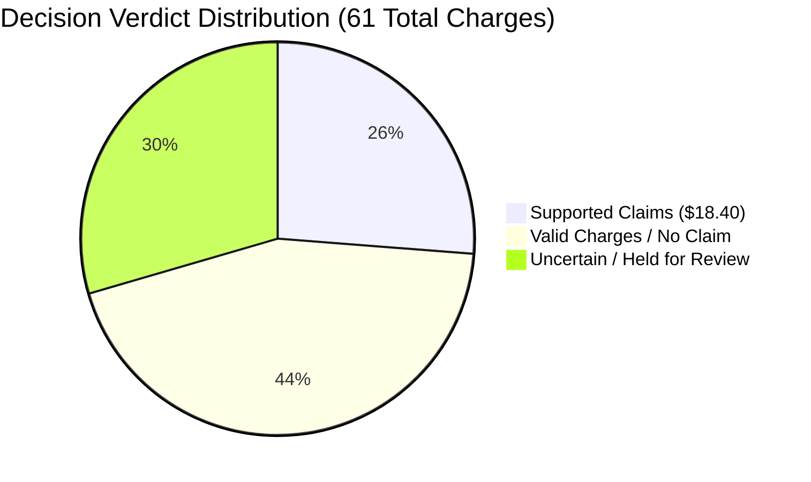

# REMA — Recovery Manager: Evaluation Report
**Precision-First Financial Recovery Verification**  
*Step 5 of 5 · Money Back*

---

## 1. Evaluation Methodology

Recovery Manager evaluation differs fundamentally from vision-based agents. Vision agents measure pixel or bounding-box accuracy; Recovery Manager measures **financial decision correctness and claim defensibility**.

Submitting an invalid claim to an e-commerce channel (e.g. Amazon Seller Support or Amazon Dispute APIs) risks severe account health penalties, audit flags, and loss of reimbursement privileges. Therefore, REMA optimizes strictly for:

$$\text{Claim Precision} = \frac{\text{Correctly Supported Claims}}{\text{All Claims Recommended}}$$

A precision of **100% (1.00)** is the primary operational benchmark.

---

## 2. Production Reference Dataset Evaluation Results

Evaluated on the official reference datasets (`data/fee_report_sample.csv` and `data/upstream/`):

### Results Breakdown by Tenant

| Metric | `org_demo_alpha` | `org_demo_bravo` | Combined / Overall |
|---|---|---|---|
| **Total Charges Evaluated** | 40 | 21 | **61** |
| **Total Channel Amount Evaluated** | $124.00 | $54.20 | **$178.20** |
| **Defensible Claims Recommended** | 13 | 3 | **16** |
| **Total Claimable Amount** | $14.80 | $3.60 | **$18.40** |
| **Correctly Supported Claims** | 13 | 3 | **16** |
| **Incorrectly Recommended Claims** | 0 | 0 | **0** |
| **Missed Recoverable Claims** | 0 | 0 | **0** |
| **Claim Precision** | **100.0% (1.00)** | **100.0% (1.00)** | **100.0% (1.00)** |
| **No-Claim Verdicts** | 16 | 11 | **27** |
| **Uncertain / Review Cases Flagged** | 11 | 7 | **18** |
| **Review Rate (Fail-Open)** | 27.5% | 33.3% | **29.5%** |
| **Average Decision Latency** | 3.48 ms | 3.67 ms | **3.55 ms** |
| **Runtime Failures / Dropped Rows** | 0 | 0 | **0** |

---

## 3. Synthetic Ground Truth Benchmark (13 Edge Cases)

To stress-test all boundary conditions, error handlers, and failure modes, REMA includes a dedicated synthetic test suite (`EvaluationEngine.runSyntheticBenchmark()`). 

> **Transparency Note**: These 13 test cases are generated synthetically to benchmark edge conditions; they are strictly labeled as synthetic benchmarks.

| Test Case ID | Description / Edge Case Scenario | Expected Verdict | Actual Verdict | Status | Defensible Rationale / Failure Mode Handled |
|---|---|---|---|---|---|
| **TC-1** | Valid recoverable claim: Inbound defect fee with Prep PASS | `CLAIM` | `CLAIM` | **PASS** | Prep audit verifies all 6 compliance points. Fee contradicted. |
| **TC-2** | Valid non-recoverable charge: Prep audit FAIL | `NO_CLAIM` | `NO_CLAIM` | **PASS** | Prep audit noted unsealed polybag. Charge supported. |
| **TC-3** | Missing evidence: Charge with no prep audit record | `UNCERTAIN` | `UNCERTAIN` | **PASS** | Fails open: missing prep evidence cannot be assumed a claim or fail. |
| **TC-4** | Conflicting evidence: Prep PASS but Receiving noted obvious defect | `UNCERTAIN` | `UNCERTAIN` | **PASS** | Upstream ambiguity prevents defensible claim. Routed to review. |
| **TC-5** | Invalid unit ID syntax (`INVALID_ID_999`) | `UNCERTAIN` | `UNCERTAIN` | **PASS** | Syntax validation prevents fabricating matches. |
| **TC-6** | Ambiguous unit match: Missing unit_id with multiple candidate FNSKUs | `UNCERTAIN` | `UNCERTAIN` | **PASS** | Ambiguity flags trigger review rather than guessing candidate. |
| **TC-7** | Malformed charge: Non-numeric amount & missing line_id | `UNCERTAIN` | `UNCERTAIN` | **PASS** | Preserves raw charge; enqueues review for data correction. |
| **TC-8** | Unsupported charge type: Unknown vendor assessment | `UNCERTAIN` | `UNCERTAIN` | **PASS** | Prevents arbitrary rule application to unknown charge categories. |
| **TC-9** | Reliable PASS against weight tier overcharge ($5.50 vs $3.50 baseline) | `CLAIM` | `CLAIM` | **PASS** | Recovers $2.00 overcharge backed by standard prep packaging. |
| **TC-10** | Reliable charge billed at baseline tier ($3.50) | `NO_CLAIM` | `NO_CLAIM` | **PASS** | Confirms charge conforms to established SKU baseline. |
| **TC-11** | Cross-source inconsistency: Chronological inversion | `CLAIM` | `CLAIM` | **PASS** | Warning captured in audit trail; valid prep evidence preserved. |
| **TC-12** | Zero-valuation lost inventory with verified dock check-in | `UNCERTAIN` | `UNCERTAIN` | **PASS** | Disallows fabricating financial figures; prompts valuation schedule. |
| **TC-13** | System fail-open: Runtime exception simulation | `UNCERTAIN` | `UNCERTAIN` | **PASS** | Preserves record in PENDING state; records error stack trace. |

**Synthetic Benchmark Score: 13 / 13 Passed (100.0%)**

---

## 4. Key Failure Modes Identified & Mitigated

### 1. The Zero-Valuation Trap (`amount_usd == 0.00`)
- **Risk**: Channel inventory adjustments (`lost_inbound`) and unreturned customer deductions (`refund_issued_item_not_returned`) frequently post with $0.00 in initial fee summaries.
- **Naive Agent Failure**: An agent might fabricate an estimated replacement value or silently discard the row.
- **REMA Solution**: Enforces Rule 5 and the Real Amount constraint. When internal records prove custody (e.g. dock check-in or returns disposition), REMA flags the record as `UNCERTAIN` with `issue_type: ZERO_VALUATION`, providing a concrete operational recommendation: "Apply SKU wholesale/replacement valuation schedule to generate defensible claim value."

### 2. Upstream Cross-Source Contradictions
- **Risk**: Prep Manager records a clean pass, but Receiving dock recorded `carton_damage: crushing` or `unit_damage: water`.
- **Naive Agent Failure**: Silently picking Prep Manager's PASS and filing a claim that gets rejected by Amazon inspectors who observe water damage.
- **REMA Solution**: Evaluates cross-source consistency. High-severity conflicts route to `UNCERTAIN / REVIEW` with both evidence IDs attached.

### 3. Ambiguous Candidate Mapping
- **Risk**: Charge record lacks `unit_id` and secondary keys map to multiple candidates.
- **REMA Solution**: Never guesses. Transitions to `AMBIGUOUS` matching status and enqueues human review with candidate listings.

---

## 5. System Limitations

1. **Valuation Schedules**: REMA relies on channel fee report values. When adjustments have $0.00 valuation, an operator must supply replacement item costs.
2. **Channel Policy Evolution**: Current charge policies reflect standard Amazon FBA schedules. New custom surcharge types require registering a corresponding policy class in `src/core/policies/`.
